::: page-banner
{.page-banner-img}
:::

My research is strongly based on collaborations with researchers from different fields, including population ecology, evolutionary ecology, conservation biology, ecological modelling, genetics, statistical ecology, physics and mathematics.

I enjoy collaborating with enthusiastic researchers, both within and beyond my own field. Collaborations may grow from shared data, complementary methods, theoretical perspectives or simply from exchanging ideas around a common question. 

## Collaborators

:::::::::: collaborator-grid
::::: collaborator-card
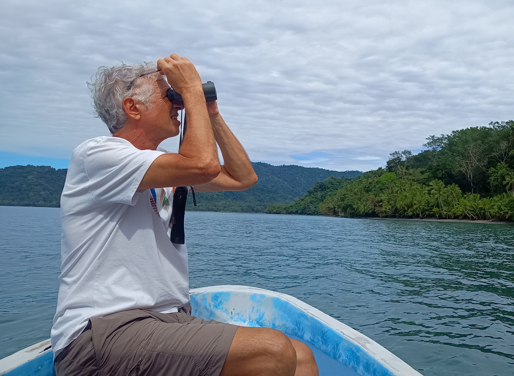{.collaborator-photo}

::: collaborator-name
Daniel Oro
:::

::: collaborator-affiliation
CEAB-CSIC
Catalonia, Spain
:::
:::::

:::: collaborator-card
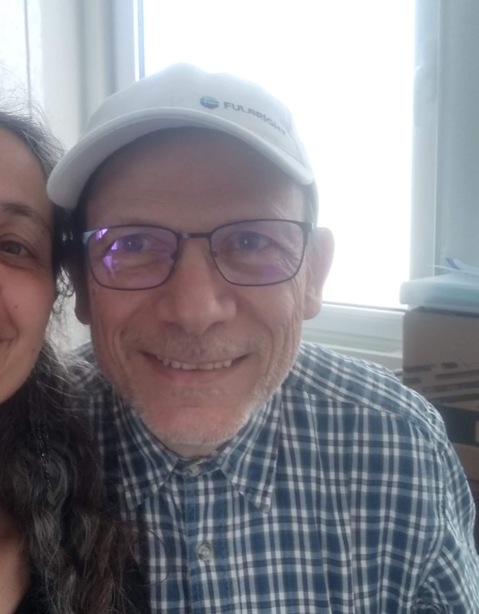{.collaborator-photo}

::: collaborator-name
Roger Pradel
:::
::: collaborator-affiliation
CEFE-CNRS
Montpellier, France
:::
::::

:::: collaborator-card
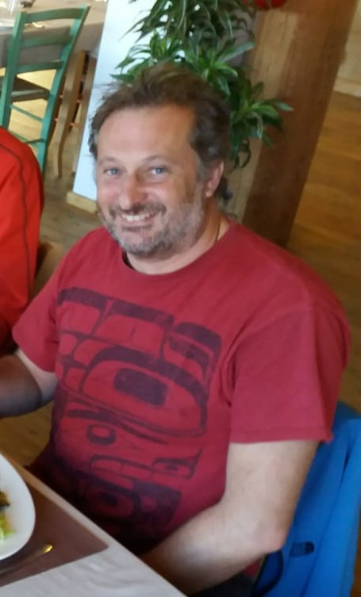{.collaborator-photo}

::: collaborator-name
Giacomo Tavecchia
:::

::: collaborator-affiliation
IMEDEA, CSIC-UIB
Mallorca, Spain
:::
::::
::::::::::

::::::::: collaborator-grid
:::: collaborator-card
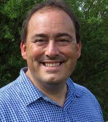{.collaborator-photo}

:::collaborator-name
Tim Coulson
:::
::: collaborator-affiliation
University of Oxford
Oxford, UK
:::
::::

:::: collaborator-card
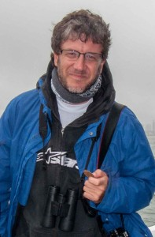{.collaborator-photo}

:::collaborator-name
José Manuel Arcos
:::

::: collaborator-affiliation
SEO/Birdlife
Catalonia, Spain
:::
::::

:::: collaborator-card
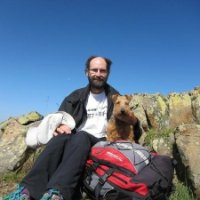{.collaborator-photo}

:::collaborator-name
Albert Bertolero
:::

::: collaborator-affiliation
Ass. Ornitològica Picampall
Catalonia, Spain
:::
::::
:::::::::

::::::::::::::::::::::::::: collaborator-grid
:::: collaborator-card
{.collaborator-photo}

:::collaborator-name
Ana Sanz
:::
::: collaborator-affiliation
IMEDEA, CSIC-UIB
Mallorca, Spain
:::
::::

:::: collaborator-card
{.collaborator-photo}

:::collaborator-name
Olivier Gimenez
:::

::: collaborator-affiliation
CEFE-CNRS
Montpellier, France
:::
::::

:::: collaborator-card
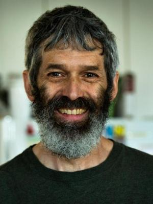{.collaborator-photo}

:::collaborator-name
Dan Doak
:::
::: collaborator-affiliation
University of Colorado Boulder,
Boulder, USA
:::
::::

:::: collaborator-card
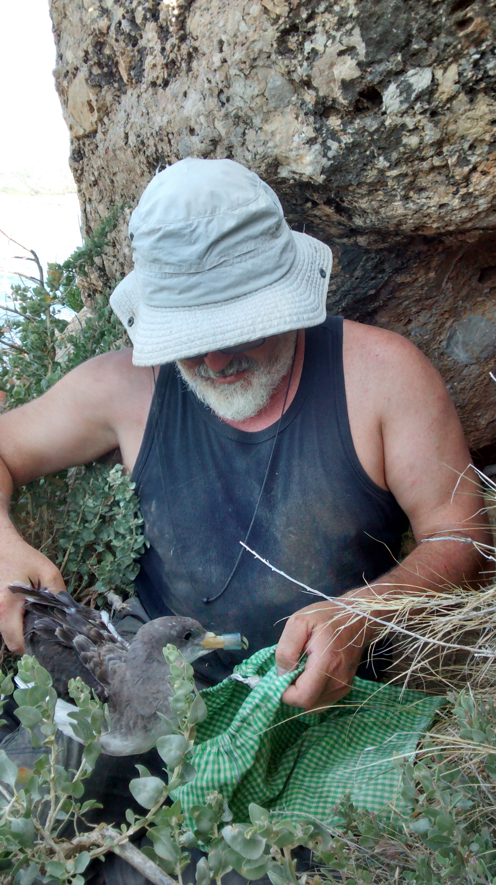{.collaborator-photo}

:::collaborator-name
José Manuel Igual
:::
::: collaborator-affiliation
IMEDEA, CSIC-UIB
Mallorca,Spain
:::
::::

:::: collaborator-card
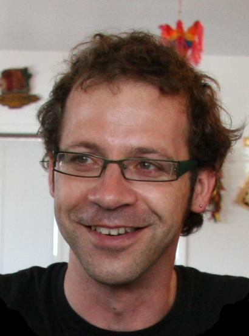{.collaborator-photo}

:::collaborator-name
Frederic Bartumeus
:::
::: collaborator-affiliation
CEAB-CSIC
Catalonia, Spain
:::
::::

:::: collaborator-card
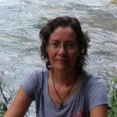{.collaborator-photo}

:::collaborator-name
Pilar Santidrian (Bibi)
:::
::: collaborator-affiliation
IEO; Leatherback Trust
Mallorca, Spain
:::
::::

:::: collaborator-card
{.collaborator-photo}

:::collaborator-name
Rob Salguero
:::
::: collaborator-affiliation
University of Oxford
Oxford, UK
:::
::::

:::: collaborator-card
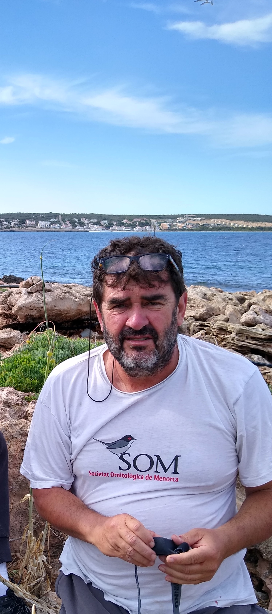{.collaborator-photo}

:::collaborator-name
Raül Escandell
:::
::: collaborator-affiliation
SOM Menorca
Menorca, Spain
:::
::::

:::: collaborator-card
{.collaborator-photo}

:::collaborator-name
Santi Catchot
:::
::: collaborator-affiliation
SOM Menorca
Menorca, Spain
:::
::::

:::: collaborator-card
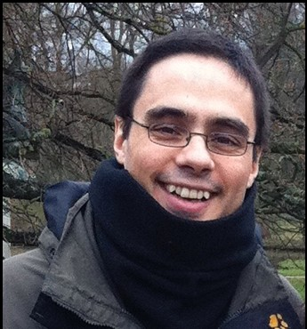{.collaborator-photo}

:::collaborator-name
Fernando colchero
:::
::: collaborator-affiliation
Max Planck
Leipzig, Germany
:::
::::

:::: collaborator-card
{.collaborator-photo}

:::collaborator-name
Fran Ramírez
:::
::: collaborator-affiliation
ICM (CSIC)
Catalonia, Spain
:::
::::

:::: collaborator-card
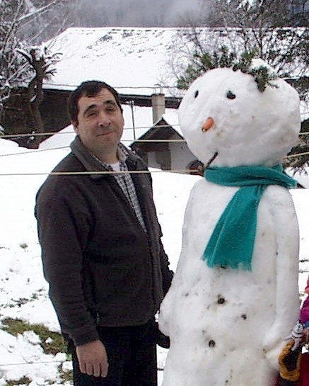{.collaborator-photo}

:::collaborator-name
Lluís Jover
:::
::: collaborator-affiliation
Facultat de Medicina, UB
Catalonia, Spain
:::
::::
:::::::::::::::::::::::::::
