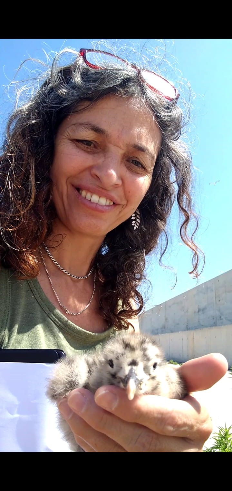
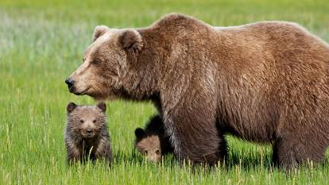
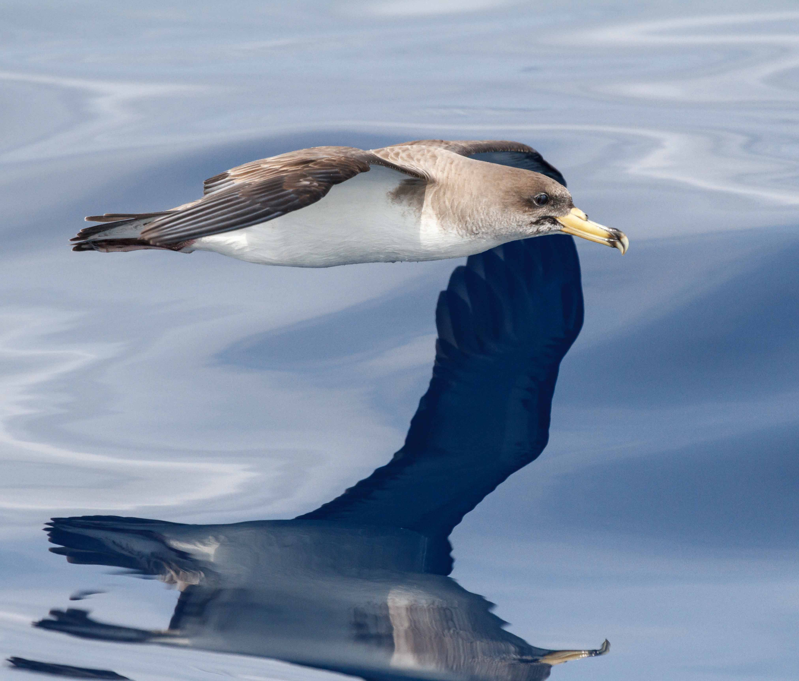
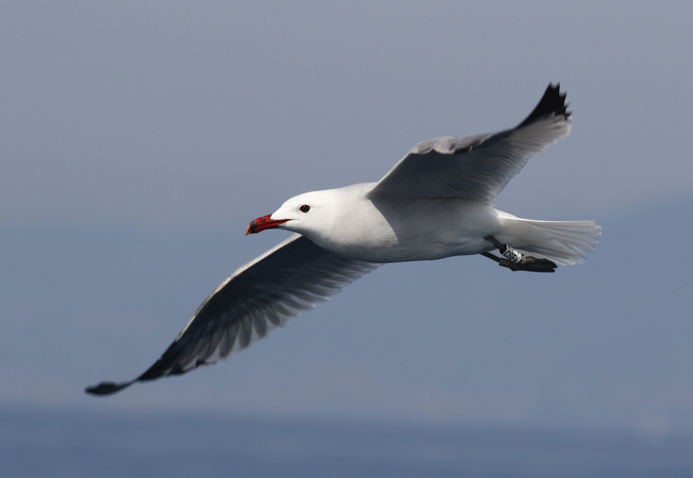
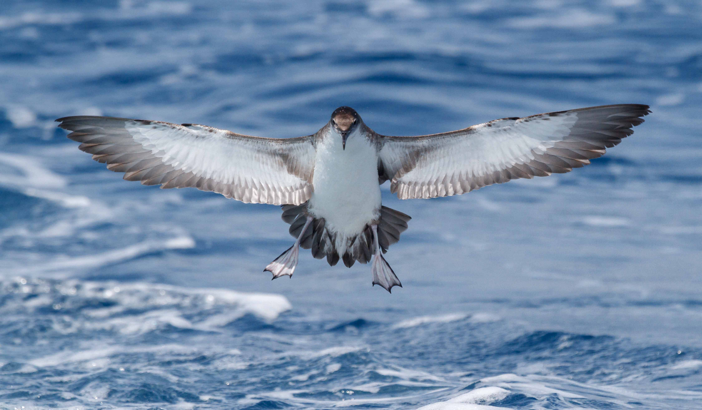
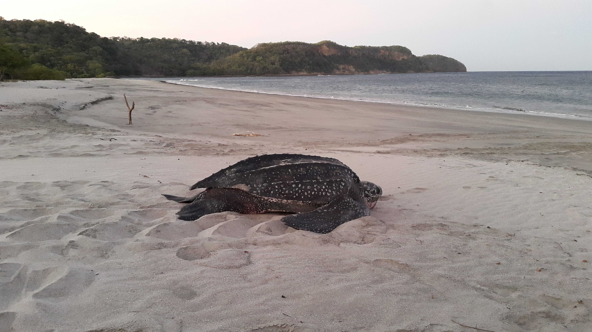

::: {.hero-card}

::: {.home-profile}

::: {.profile-sidebar}

{.home-photo}

::: {.profile-links}
[ORCID](https://orcid.org/0000-0003-2919-1288)

[Google Scholar](https://scholar.google.es/citations?user=ZOOe0UkAAAAJ&hl=es)

[GitHub](https://github.com/MeritxellGeno)

[CEAB-CSIC](https://www.ceab.csic.es/en/){.extra-space-above}

[Theelab](https://theelab.net/)

[Bycatch](https://www.bycatch.csic.es/en/)

[Biodiversity Challenges](https://biodiversitat.csic.es/cat/)
:::

:::

::: {.home-text}

My research is driven by the aim of understanding how life-history strategies and demographic processes shape ecological and evolutionary responses to environmental change, from individual populations and species to ecological communities. From a quantitative demographic perspective, I am interested in how differences among individuals, populations and species influence vulnerability, resilience and persistence, and how they may scale up to generate emergent patterns in natural systems.

By combining long-term data from natural populations with statistical modelling, simulations and ecological theory, my work seeks to identify the demographic and evolutionary mechanisms underlying ecological change and to contribute to a more predictive ecology for biodiversity conservation.

::: {.research-tags}
[Demography]{.research-tag .tag-demography}
[Population ecology]{.research-tag .tag-population}
[Life-history strategies]{.research-tag .tag-lifehistory}
[Biodiversity]{.research-tag .tag-biodiversity}
[Conservation biology]{.research-tag .tag-conservation}
[Resilience]{.research-tag .tag-resilience}
[Evolutionary Ecology]{.research-tag .tag-evolution}
[Stochasticity]{.research-tag .tag-evolution}
[Complex Systems]{.research-tag .tag-complex}

:::

::: {.contact-info}
**Email:** [m.genovart@csic.es](mailto:m.genovart@csic.es)  
**Affiliation:** Centre d'Estudis Avançats de Blanes ([CEAB-CSIC](https://www.ceab.csic.es/en/))
:::
:::
:::
:::

::: {.home-photo-strip}

:::