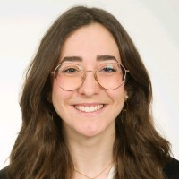
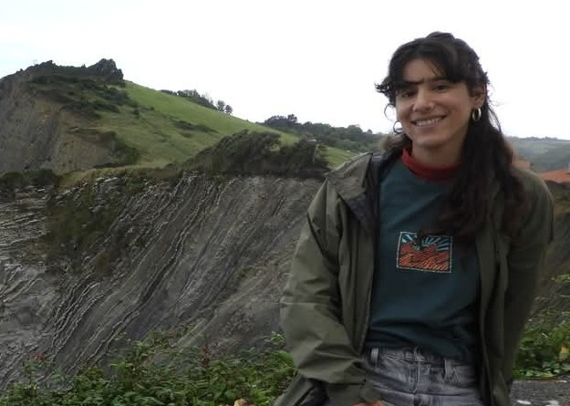
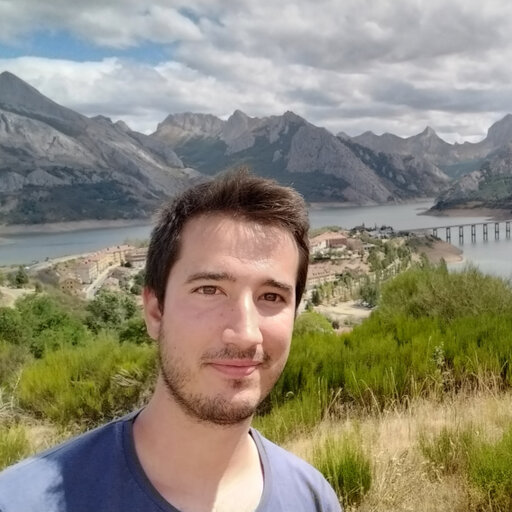
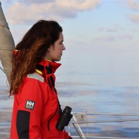
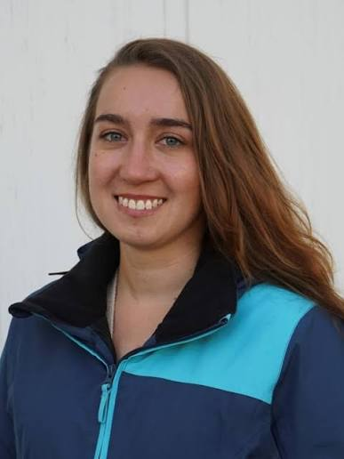
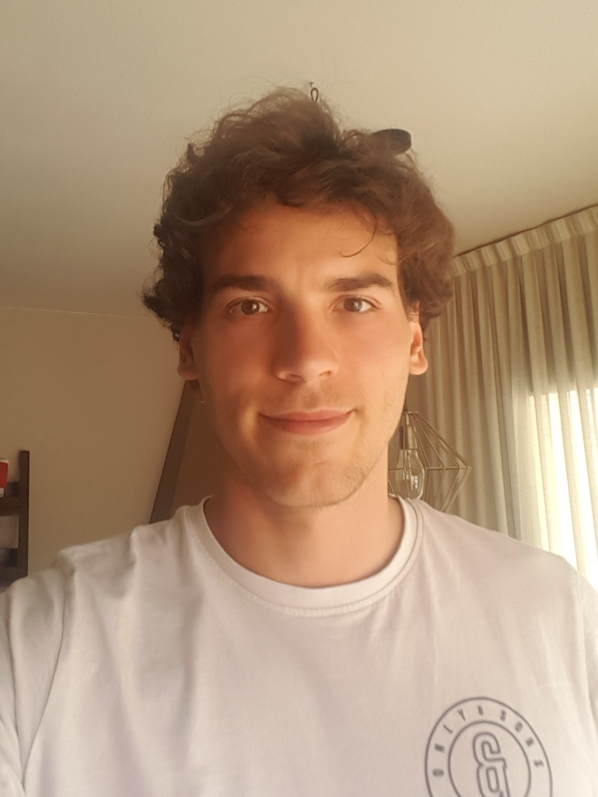

::: {.page-banner}
{.page-banner-img}
:::

Research is a collective process. This page brings together current and former students and postdoctoral researchers who have worked with me or under my supervision, contributing to different projects. Many other colleagues have also been part of this wider collective effort; they are included on the Collaborations page.

## TFG students

::: {.person}
{.person-photo}

::: {.person-text}
### Anna Seseras Fuentesaúco

**Degree:** BSc in Biology  
**Project:** Diferències Individuals en l'Explotació dels Subsidis
Pesquers en la Gavina Corsa: Factors Determinants i
Conseqüències Demogràfiques.  
**Period:** 2025–2026  

:::
:::

## TFM students

::: {.person}
{.person-photo}

::: {.person-text}
### Alicia Gonzalez Rodiles

**Master:** MSc in Marine Biological Resources IMBRSea  
**Project:** Understanding the Spatial Distribution of Audouin’s Gull beyond Breeding Colonies in Catalonia: Insights from Citizen Science Data

**Period:** 2025–2026  

:::
:::
::: {.person}
{.person-photo}

::: {.person-text}
### Andreu Rocamora Martorell

**Master:** MSc in Complex Systems  
**Project:** Intraspecific Biomass Fluxes Reshape the Dynamics of Ecological Communities.  
**Period:** 2025–2026  

:::
:::

## Postdocs

::: {.person}
{.person-photo}

::: {.person-text}
### Àlex Giménez-Romero

**Position:** Juan de la Cierva Postdoctoral researcher  
**Project:** Hacia un nuevo marco teórico para predecir colapsos y evaluar la resiliencia de poblaciones y comunidades en sistemas ecológicos  
**Period:** 2025–present  
:::
:::

## PhD students

::: {.person}
{.person-photo}

::: {.person-text}
### Name Surname

**PhD programme:** ...  
**Project:** -  
**Period:** -  
**Co-supervision:** -
:::
:::
## Former members

::: {.person}
{.person-photo}

::: {.person-text}
### Mar Leon Salmeron

**Position:** MSc International Professional Practice (IMBRSea) 
**Project:** Fecundity Analysis of the Scopoli’s Shearwater (*Calonectris diomedea*) Colony at L'Illa de l'Aire, Menorca 
**Period:** 2024
:::
:::

::: {.person}
{.person-photo}

::: {.person-text}
### Katerina Klementisová

**Degree:** Erasmus+ Student, University of St Andrews 
**Project:** Statistical modelling for conservation biology 
**Period:** 2019
:::
:::

::: {.person}
{.person-photo}

::: {.person-text}
### Miquel Pons

**Degree:** MSc Student, Biodiversité, écologie, évolution, Université de Perpignan Via Domitia 
**Project:** Demographic analysis of resident long-finned pilot whales (*Globicephala melas*) in the Strait of Gibraltar using multi-event capture-recapture modelling 
**Period:** 2017–2018
:::
:::

