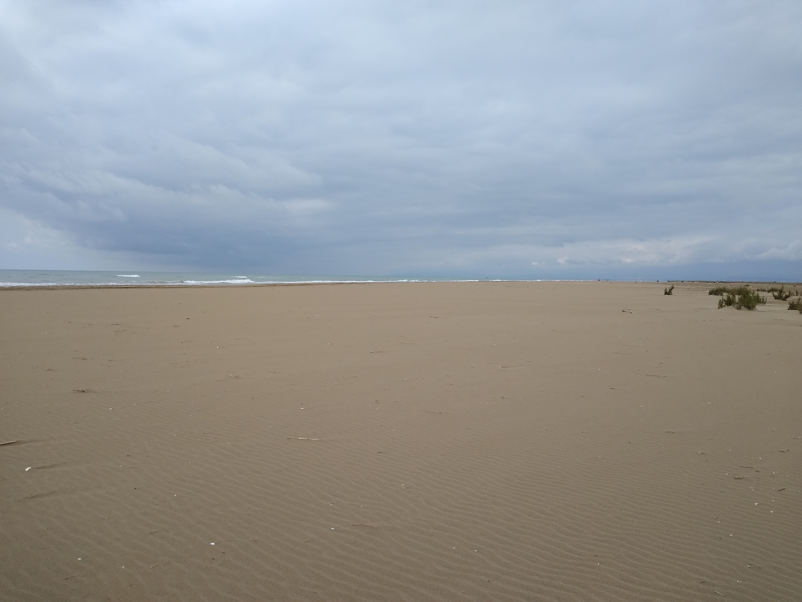
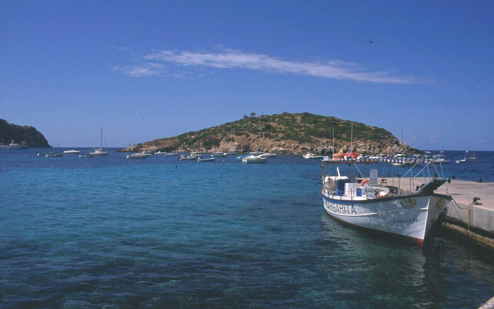
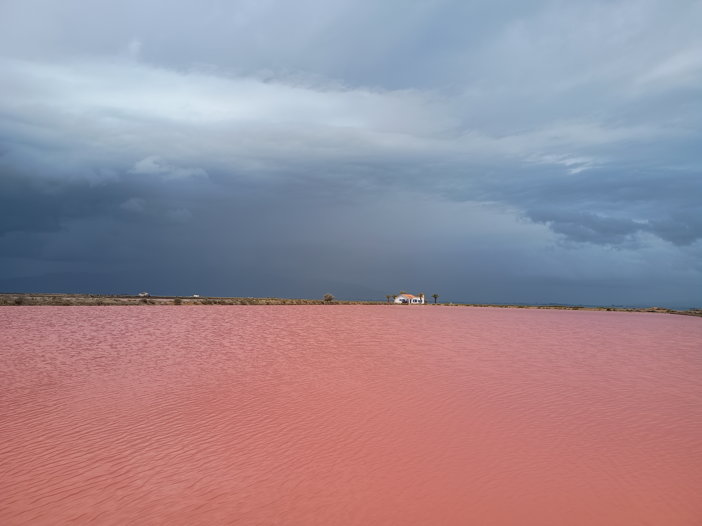
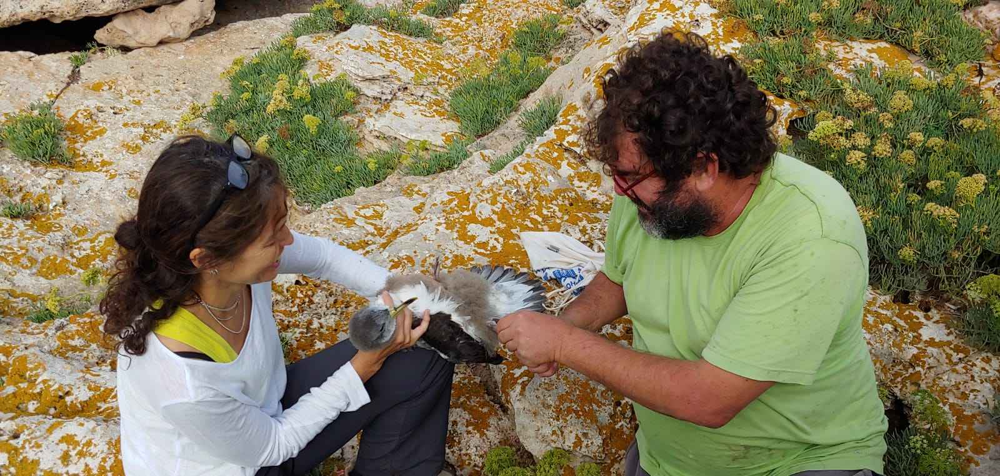
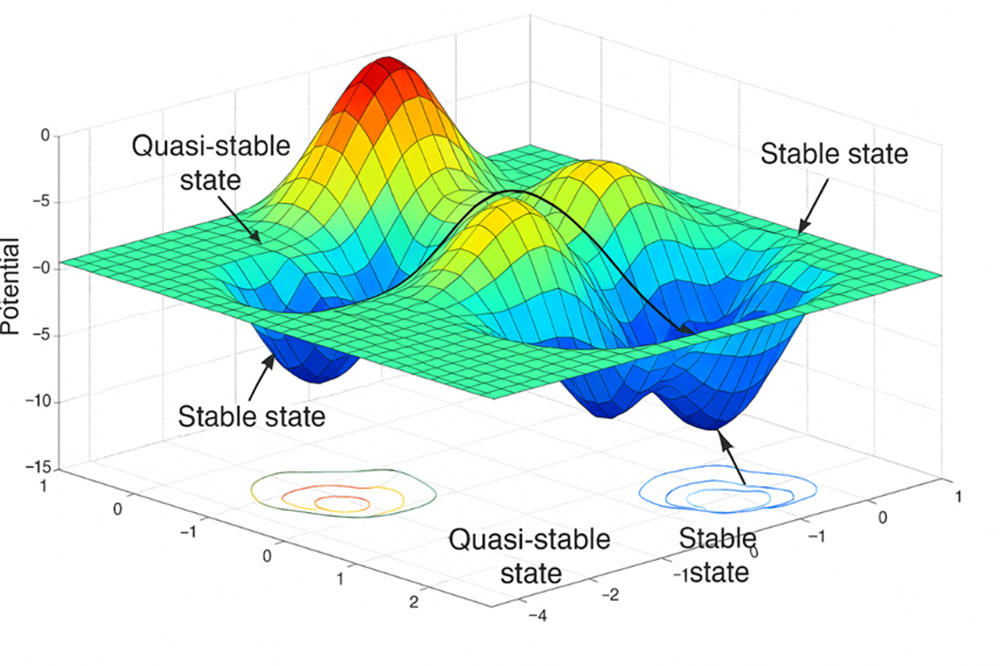
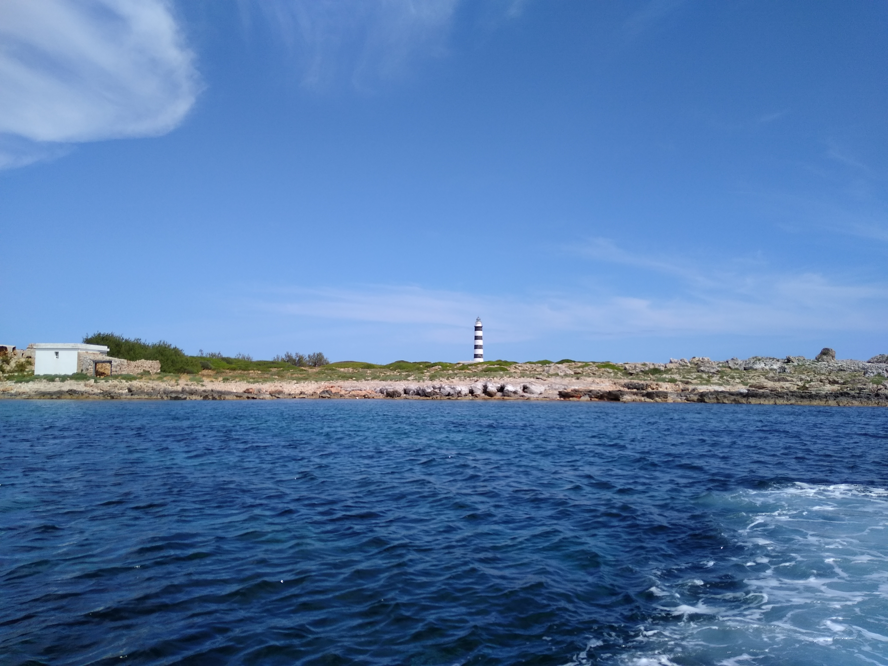
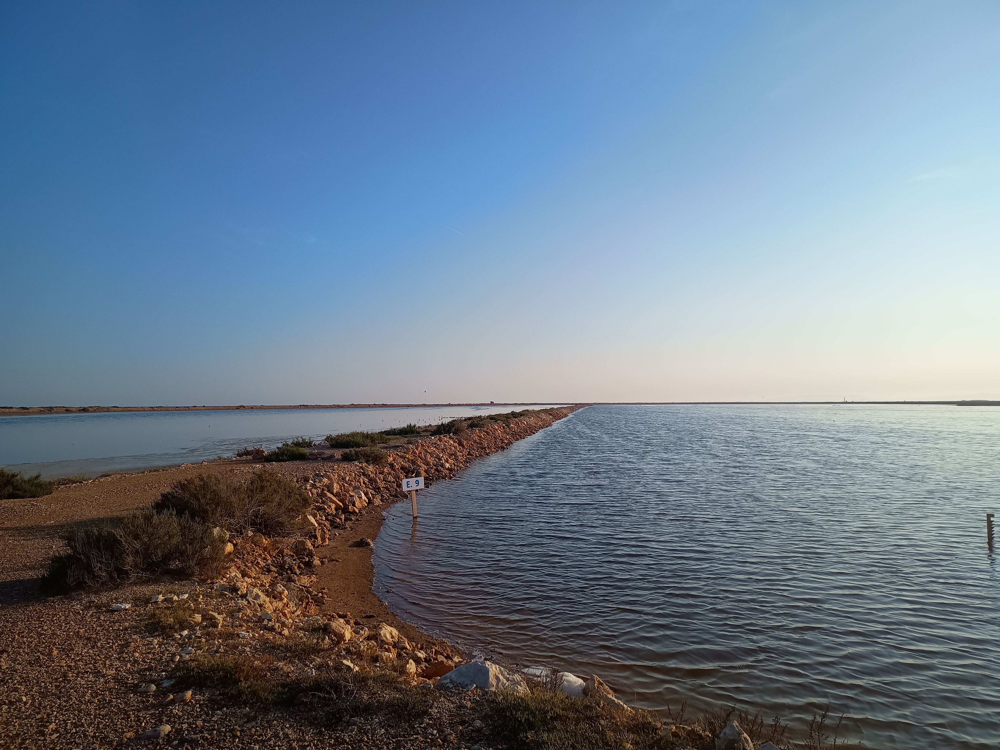
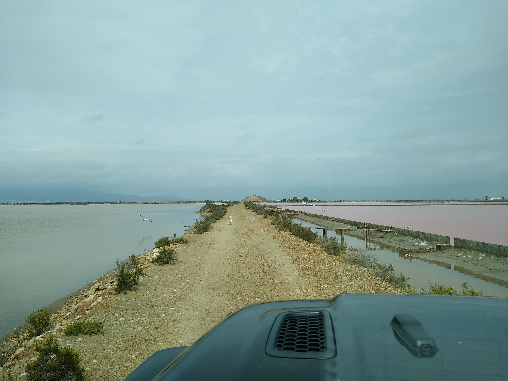
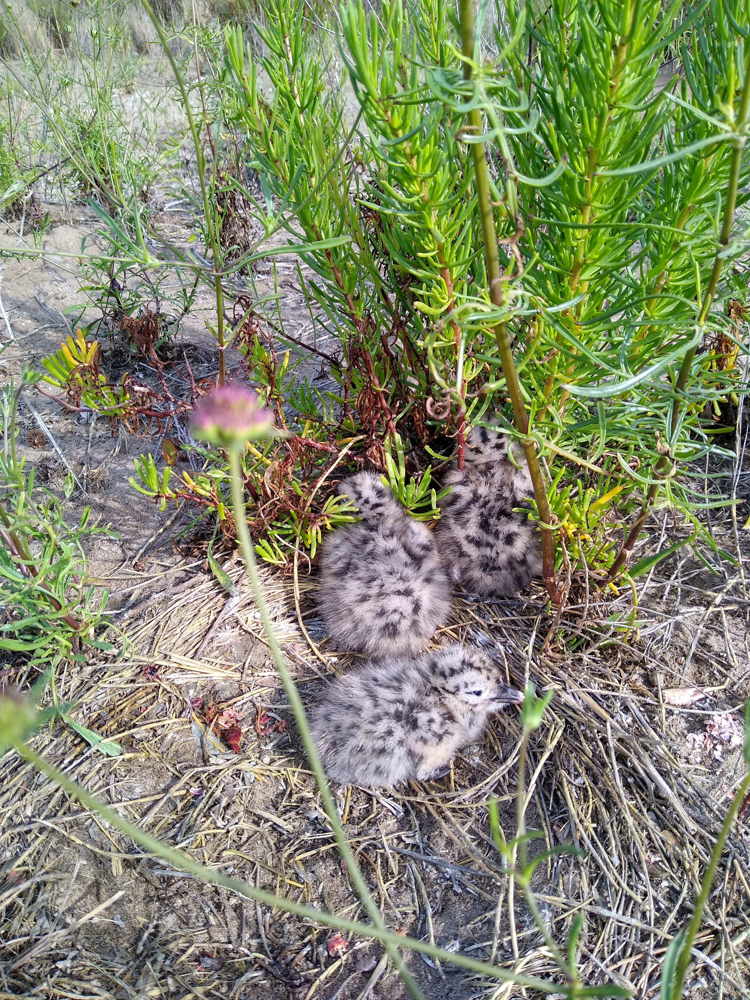
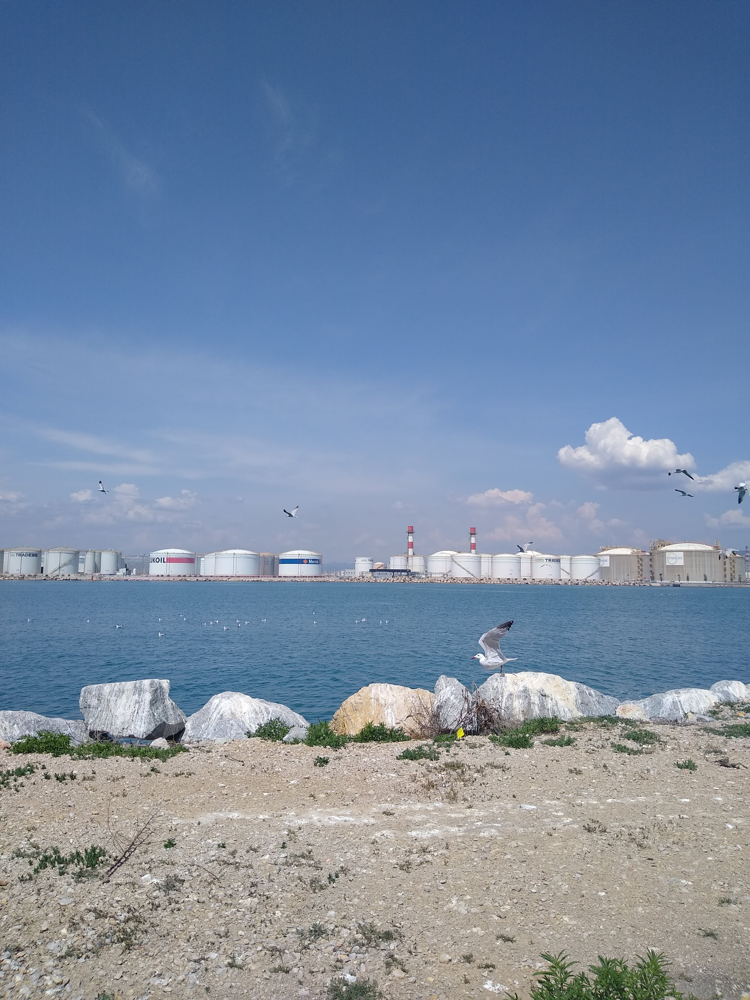

::: page-banner
{.page-banner-img}
:::

Much of my research is based on long-term demographic monitoring of wildlife populations. These long-term datasets provide a unique opportunity to identify the demographic mechanisms through which environmental variability shapes population dynamics across space and time. Beyond the data they generate, these long-term monitoring programs have been, and continue to be, one of my main sources of scientific inspiration.

My strongest empirical background comes from Mediterranean coastal habitats, islands and small islets inhabited by my main study species. At the same time, analysing data from a wide diversity of species, life-history strategies and ecosystems has broadened my perspective to systems exposed to different environmental conditions, disturbance regimes and conservation challenges. 

## Main study species

### Audouin’s gull

::: {.species-text}

{.species-photo-left}
Audouin’s gull *Larus audouinii* is a long-lived, colonial seabird with a social, bet-hedging life-history strategy. Once endemic to the Mediterranean, the species has recently expanded its breeding range beyond the basin, establishing colonies along the Atlantic coast of Portugal. Its conservation status has fluctuated over recent decades, partly reflecting the rapid growth and subsequent decline of the Ebro Delta colony, historically the largest breeding colony of the species. Long-term monitoring of Audouin’s gulls in the western Mediterranean started in the late 1980s and now includes tens of thousands of marked individuals and resightings across multiple breeding patches. This system provides exceptional data for studying demographic processes and population dynamics across multiple levels, from individual life histories and local breeding patches to population trends, metapopulation dynamics and responses to environmental and anthropogenic change.

### Scopoli’s shearwater

:::{.species-text}

{.species-photo-left}

Scopoli’s shearwater *Calonectris diomedea* is a long-lived seabird with a life-history strategy clearly placed towards the slow end of the fast–slow continuum. Endemic to the Mediterranean, Scopoli’s shearwater breeds mainly on islands and coastal sites across the region and undertakes long-distance transequatorial migrations, with wintering areas along the African coast, extending as far south as Namibia and South Africa. Scopoli’s shearwater is a valuable study system for exploring how long-lived species respond to environmental change and human impacts, including incidental mortality in fishing gear, which is a major threat for many seabirds and especially procellariiforms.
:::

### Balearic shearwater and other marine vertebrates

Beyond my main long-term monitoring systems, I have also worked extensively on other threatened marine vertebrates, including the critically endangered Balearic shearwater *Puffinus mauretanicus* and the leatherback turtle *Dermochelys coriacea*. In these systems, my work has focused on understanding the demographic processes that drive population dynamics and conservation status, providing evidence to inform management. In the case of the Balearic shearwater, I have also worked on molecular genetic approaches to assess population structure, clarify taxonomic status and provide additional information relevant to conservation. Like many long-lived marine vertebrates, these species are also exposed to major conservation pressures, including fisheries bycatch and global change.

### Other 

Beyond seabirds and marine turtles, I have also occasionally worked with a range of other taxa and systems, including brown bears, lizards, butterflies, trout, dolphins and long-finned pilot whales. These studies have been developed in close collaboration with colleagues who lead the monitoring programs and bring detailed knowledge of the natural history of the species and the ecological context of each system.

:::::::::::::::::::::::::::: study-carousel
::::::::::::::::::::::::::: study-carousel-track
::: study-slide

:::

::: study-slide

:::

::: study-slide

:::

::: study-slide

:::

::: study-slide

:::

::: study-slide

:::

::: study-slide

:::

::: study-slide

:::

::: study-slide

:::

::: study-slide

:::

::: study-slide

:::

::: study-slide

:::

<!-- Repeated set for smooth infinite scrolling -->

::: study-slide

:::

::: study-slide

:::

::: study-slide

:::

::: study-slide

:::

::: study-slide

:::

::: study-slide

:::

::: study-slide

:::

::: study-slide

:::

::: study-slide

:::

::: study-slide

:::

::: study-slide

:::

::: study-slide

:::
:::::::::::::::::::::::::::
::::::::::::::::::::::::::::
